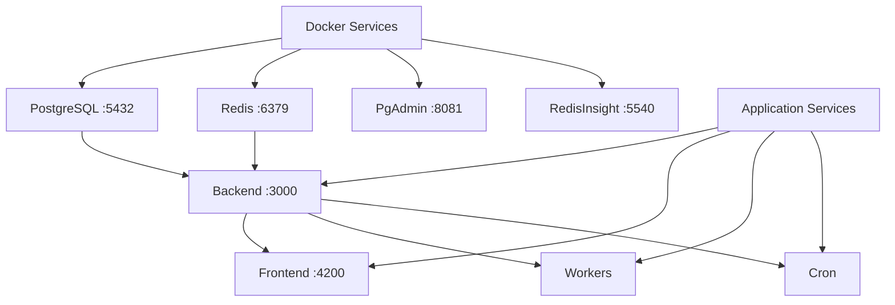

# 📋 Résumé des Scripts de Gestion Specters

Ce document résume tous les scripts et fichiers créés pour la gestion complète de l'application Specters.

## 🎯 Scripts Principaux

### 1. **specters-manager.sh** (Linux/macOS/WSL)
Script principal bash pour la gestion complète de l'application.

**Utilisation :**
```bash
./specters-manager.sh [start|stop|restart|status|logs|help] [options]
```

**Fonctionnalités :**
- ✅ Démarrage/arrêt complet de l'application
- ✅ Vérification des prérequis (Node.js, pnpm, Docker)
- ✅ Gestion des services Docker (PostgreSQL, Redis, PgAdmin, RedisInsight)
- ✅ Installation automatique des dépendances
- ✅ Configuration automatique de la base de données (Prisma)
- ✅ Démarrage des services applicatifs (backend, frontend, workers, cron)
- ✅ Gestion des PIDs et arrêt gracieux
- ✅ Logs détaillés et monitoring
- ✅ Mode verbeux et dry-run

### 2. **specters-manager.ps1** (Windows PowerShell)
Version PowerShell du script principal pour Windows.

**Utilisation :**
```powershell
.\specters-manager.ps1 [start|stop|restart|status|logs|help] [-Verbose] [-DryRun]
```

**Fonctionnalités identiques au script bash :**
- ✅ Interface PowerShell native
- ✅ Gestion des couleurs et formatage Windows
- ✅ Test-NetConnection pour vérification des ports
- ✅ Gestion des processus Windows

### 3. **specters-manager.bat** (Windows Batch)
Version batch pour compatibilité Windows maximale.

**Utilisation :**
```cmd
specters-manager.bat [start|stop|restart|status|logs|help] [options]
```

## 🚀 Scripts de Raccourci

### **start.sh**
```bash
#!/bin/bash
./specters-manager.sh start "$@"
```

### **stop.sh**
```bash
#!/bin/bash
./specters-manager.sh stop "$@"
```

## 📖 Documentation

### **README-MANAGER.md**
Guide d'utilisation complet avec :
- 📋 Prérequis détaillés
- 🎯 Exemples d'utilisation
- 🌐 Ports et services
- 🔧 Fonctionnalités avancées
- 🚨 Guide de dépannage
- 📝 Exemples pratiques

## ⚙️ Configuration

### **specters-config.json**
Fichier de configuration centralisé contenant :
- 🔧 Configuration des services
- 🐳 Paramètres Docker
- ⏱️ Timeouts personnalisables
- 📊 URLs des services
- 🔐 Identifiants par défaut
- 🎛️ Fonctionnalités activables/désactivables

## 🏗️ Architecture des Services



## 📁 Structure des Fichiers Créés

```
📦 Specters/
├── 🔧 specters-manager.sh      # Script principal (Linux/macOS)
├── 🔧 specters-manager.ps1     # Script PowerShell (Windows)
├── 🔧 specters-manager.bat     # Script Batch (Windows)
├── 🚀 start.sh                 # Raccourci démarrage
├── 🛑 stop.sh                  # Raccourci arrêt
├── 📖 README-MANAGER.md        # Documentation complète
├── ⚙️ specters-config.json     # Configuration
├── 📋 SCRIPTS-SUMMARY.md       # Ce fichier
├── 📊 logs/                    # Dossier des logs (créé automatiquement)
│   ├── backend.log
│   ├── frontend.log
│   ├── workers.log
│   └── cron.log
├── 📝 specters-manager.log     # Log du gestionnaire
└── 🔒 .specters-pids           # Fichier des PIDs (temporaire)
```

## 🎮 Commandes Disponibles

| Commande | Description | Exemple |
|----------|-------------|---------|
| `start` | Démarrer l'application complète | `./specters-manager.sh start` |
| `stop` | Arrêter l'application complète | `./specters-manager.sh stop` |
| `restart` | Redémarrer l'application | `./specters-manager.sh restart` |
| `status` | Afficher l'état des services | `./specters-manager.sh status` |
| `logs` | Afficher les logs | `./specters-manager.sh logs backend` |
| `help` | Afficher l'aide | `./specters-manager.sh help` |

## 🔧 Options Disponibles

| Option | Description | Exemple |
|--------|-------------|---------|
| `-v, --verbose` | Mode verbeux | `./specters-manager.sh start --verbose` |
| `-d, --dry-run` | Simulation sans exécution | `./specters-manager.sh start --dry-run` |
| `-h, --help` | Afficher l'aide | `./specters-manager.sh --help` |

## 🌐 Services et Ports

| Service | Port | URL | Description |
|---------|------|-----|-------------|
| **Frontend** | 4200 | http://localhost:4200 | Interface utilisateur Next.js |
| **Backend** | 3000 | http://localhost:3000 | API NestJS |
| **PostgreSQL** | 5432 | - | Base de données principale |
| **Redis** | 6379 | - | Cache et queues |
| **PgAdmin** | 8081 | http://localhost:8081 | Interface PostgreSQL |
| **RedisInsight** | 5540 | http://localhost:5540 | Interface Redis |

## 🔐 Identifiants par Défaut

### PgAdmin
- **Email :** admin@admin.com
- **Mot de passe :** admin

## 🚀 Démarrage Rapide

### Linux/macOS/WSL
```bash
# Rendre exécutable
chmod +x specters-manager.sh start.sh stop.sh

# Démarrer l'application
./start.sh

# Ou utiliser le script principal
./specters-manager.sh start

# Vérifier l'état
./specters-manager.sh status

# Arrêter l'application
./stop.sh
```

### Windows PowerShell
```powershell
# Démarrer l'application
.\specters-manager.ps1 start

# Vérifier l'état
.\specters-manager.ps1 status

# Arrêter l'application
.\specters-manager.ps1 stop
```

### Windows Command Prompt
```cmd
REM Démarrer l'application
specters-manager.bat start

REM Vérifier l'état
specters-manager.bat status

REM Arrêter l'application
specters-manager.bat stop
```

## 🔄 Workflow Typique

1. **Première utilisation :**
   ```bash
   ./specters-manager.sh start --verbose
   ```

2. **Utilisation quotidienne :**
   ```bash
   ./start.sh          # Démarrer
   ./specters-manager.sh status  # Vérifier
   ./stop.sh           # Arrêter
   ```

3. **Dépannage :**
   ```bash
   ./specters-manager.sh logs backend
   ./specters-manager.sh restart
   ```

## 🎯 Avantages

### ✅ **Simplicité**
- Une seule commande pour tout démarrer
- Scripts de raccourci pour usage quotidien
- Interface intuitive et colorée

### ✅ **Robustesse**
- Vérification automatique des prérequis
- Gestion des erreurs et timeouts
- Arrêt gracieux des processus

### ✅ **Monitoring**
- Logs détaillés pour chaque service
- Vérification de l'état en temps réel
- Gestion des PIDs pour suivi des processus

### ✅ **Flexibilité**
- Mode dry-run pour tester
- Mode verbeux pour debugging
- Configuration personnalisable

### ✅ **Multi-plateforme**
- Support Linux, macOS, Windows
- Scripts adaptés à chaque environnement
- Compatibilité WSL

## 🔮 Fonctionnalités Futures

- [ ] Interface web de monitoring
- [ ] Notifications de statut
- [ ] Sauvegarde automatique
- [ ] Déploiement en production
- [ ] Intégration CI/CD
- [ ] Métriques de performance
- [ ] Auto-scaling des workers

---

**🎉 L'application Specters dispose maintenant d'un système de gestion complet et professionnel !**

Pour toute question ou amélioration, consultez la documentation dans `README-MANAGER.md`.
